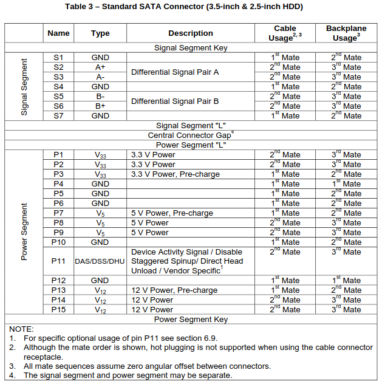

# SATA hot-plugging

Unless otherwise stated, this document references the
[Serial ATA Revision 3.1 Gold Revision](https://sata-io.org/system/files/specifications/SerialATA_Revision_3_1_Gold.pdf)

## Hot-Plug events definitions

see **7.2.5 Hot Plug Considerations** 

### Asynchronous Signal Hot Plug / Removal:
A signal cable is plugged / unplugged at
any time. Power to the Host/Device remains on since it is sourced through an alternate
mechanism, which is not associated with the signal cable. This applies to External
Single-Lane and Multilane Cabled applications.

### Unpowered OS-Aware Hot Plug / Removal:
This is defined as the insertion / removal of
a Device into / from a backplane connector (combined signal and power) that has power
shutdown. Prior to removal, the Host is placed into a quiescent state (not defined here)
and power is removed from the backplane connector to the Device. After insertion, the
backplane is powered; both the Device and Host initialize and then operate normally.
The mechanism for powering the backplane on/off and transitioning the Host into/out of
the “quiescent” state is not defined here. During OS-Aware events, the Host is powered.
This applies to “Short” and “Long” Backplane applications.

### Powered OS-Aware Hot Plug / Removal:
This is defined as the removal of a Device
into / from a backplane connector (combined signal and power) that has power on. After
insertion, both the Device and Host initialize and then operate normally. Prior to insertion
or removal, the Host is placed into a quiescent state (not defined here) but the backplane
connector to the Device is powered at all times. The mechanism for transitioning the
Host into/out of the “quiescent” state is not defined here. During OS-Aware events, the
Host is powered. This applies to “Short” and “Long” Backplane applications.

### Surprise Hot-Plug / Removal:
This is defined as the insertion / removal of a Host or
Device into / from a backplane connector (combined signal and power) that has 
power on. After insertion, both the Device and Host initialize and then operate 
normally. The powered Host or Device is not in a quiescent state

## Hardware Hot-plug support

There are two things that needs to be considered when designing a SATA hot-plug
circuit, the power and the signals.

### 1. Power maiting order

The power pins are designed to be mated in a specific order, on the SATA 
connector the pre-charge pins P3,7,13 are designed to be mated first, to 
pre-charge the circuit via a resistor before the main power pins are mated. 
This is to limit inrush current.

To ensure proper maiting order, the connector must be insterted with a zero 
angular offset to the disk i.e. inserted straight in. To achieve this, usually 
a backplane and a guide rail for the disk is used.

When the powersupply and wirering is adequate, the pre-charge pins can be left 
unconnected.

### 2. Differential signal pairs
If there is a voltage differential between the HBA (Host Bus Adapter) and the
disk prior to maiting, the differential signal pair A and B could become 
damaged due to inrush current. 

To prevent this, it requires the use of ac-coupling capacitors. See calculation 
of the capacitor value in **7.2.5.3 Common-Mode Transients**. Suggested values 
by e.g. TI for the capacitor is 10nF, see 
[SN75LVCP601 datasheet](https://www.ti.com/lit/ds/symlink/sn75lvcp601.pdf?ts=1693568146060)

### Disable Staggered Spin-up (DSS) pin P11 
Staggered Spin-up is a mechanism used by the HBA (Host Bus Adapter) to reduce 
the inrush current of multiple devices simultaneously spinning up. See 
**6.9.4 Staggered Spin-up Disable Control** 

The DSS is active LOW, and internally in the disk it is pulled HIGH, meaning 
that the staggered spin-up is enabled by default if the HBA does not support 
DSS, and the disk will therefore only spin-up when it receives a command. 
When disabled (LOW), the disk will spin-up when power is applied.

## Scan for new disks after hot-plugging

To scan for new disks after hot-plugging, the following command can be used 
on Debian/Ubuntu:

```bash
for host in /sys/class/scsi_host/*; do 
    echo "- - -" >> $host/scan
done
```

The three dashes are wildcards to scan: channel, SCSI target ID, and LUN.

## Standard SATA connector 3.5" and 2.5"

